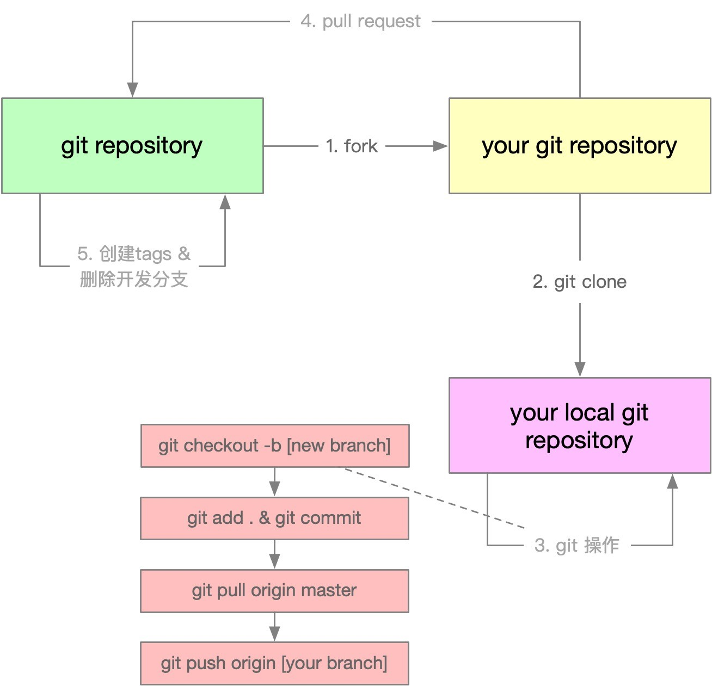

## 脚手架需求分析

### 痛点分析


- 创建项目/组件时，存在大量重复代码拷贝：快速复用已有沉淀
- 协同开发时，由于 git 操作不规范，导致分支混乱，操作耗时：制定标准的 git 操作规范并集成到脚手架
- 发布上线耗时，而且容易出现各种错误：制定标准的上线流程和规范并集成到脚手架

### 需求分析，如何构建一个优秀的脚手架呢？

1. 通用的研发脚手架
2. 通用的研发脚手架

- 模板支持定制，定制后能够快速生效
- 模板支持快速接入，极低的接入成本

3. 通用的项目/组件发布能力

- 发布过程自动完成标准的 git 操作
- 发布成功后自动删除开发分支并创建 tag
- 发布后自动完成云构建、OSS 上传、CDN 上传、域名绑定
- 发布过程支持测试/正式两种模式
### 大厂git操作


### 核心价值
将研发过程
* 自动化 - 项目重复代码拷贝、git操作、发布上线操作
* 标准化 - 项目创建/git flow/发布流程、回滚流程
* 数据话 - 研发过程体系化，数据化，使得研发过程可量化

## 命令基础

- /usr/bin/env
  node 的环境变量指向的就是 bin 这个文件夹，bin 下面的目录是用来存放可执行文件的，如果存在才会执行该命令。
  可以通过 <code>/usr/bin/env</code> 命令查看一下 node 的环境变量 - 针对 mac 环境

- echo $PATH - 找到所有环境变量

## 什么是脚手架

脚手架本质上是一个操作系统的客户端，他通过命令行执行，比如

```js
vue create vue-test-app
// 上面的命令由三部分组成
* 主命令: vue
* command: create
* command的param: vue-test-app
// 表示创建一个vue的项目，项目名称为vue-test-app，简单创建场景
// 有一些复杂场景，例如 当前目录下已经有文件了，我们需要覆盖当前目录下 的文件，强制进行安装vue项目
vue create vue-test-app --force
// --force 在此处称为 option，用来辅助脚手架确认在特定场景下用户的选择
// 补充场景 比如 vue create创建项目，会自动执行npm install帮助用户安装依赖，如果需要使用淘宝源
vue create vue-test-app --force -r https://registry.npm.taobao.org
// -r 也称为option 与--force不同的是，--force使用- -》其实此处是简写，--registry
vue create --help
// -r后面的 https://registry.npm.taobao.org 称为option的param参数
// 另外 --force 可以理解为 --force true 简写为 --force或-f


1. 在环境变量中去寻找vue命令，将后面的内容作为参数传入到vue.js中  -> which vue
/usr/local/bin/vue
// 直接 使用vue命令 执行的是/usr/local/bin/vue 的vue文件
lrwxr-xr-x   1 zhangli  admin    64B  9 15 21:55 vue -> ../../../Users/zhangli/.config/yarn/global/node_modules/.bin/vue
lrwxr  - l表示是一个软连接，实际指向node安装目录下面的vue.js文件


```

通过 npm -g 安装的一些命令都会放到 /usr/local/lib/node_modules 目录下面

- 在终端输入 vue create vue-test-app
- 终端解析出 vue 命令
- 终端在环境碧变量中找到 vue
- 终端根据 vue 命令链接到实际文件 vue.js
- 终端利用 node 执行 vue.js
- vue.js 解析 command/options
- vue.js 执行 command
- 执行完毕，退出执行

## 两种写法需要注意一下

```js
#!/usr/bin/env node
#!/usr/bin/node
```

- 第一种是在环境变量中查找 node
- 第二种是执行 <code>/usr/bin</code> 目录下的 node

## 脚手架开发流程

### 开发流程

- 创建 npm 项目
- 创建脚手架入口文件，在最上方添加 <code>#!/usr/bin/env node</code>
- 配置 package.json，添加 bin 属性
- 编写脚手架代码
- 将脚手架发布到 npm

### 开发难点

- 分包: 将复杂的模块拆分成若干个模块
- 命令注册
- 比如 vue create / vue add /vue invoke
- 参数解析
  1. options 的全称： --version --help
  2. options 的简写： -V -h
  3. 带 params 的 options：--path /usr/zl/Desktop/xxx
- 代码块 <code>vue command [options] <params></code>
- 帮助文档 - global help

### 工具
1. yargs 实践学习 - cli-test/zl-cli-test/bin/yargs.js
2. pkg-dir -> find-up
3. path-exists   判断一个路径是否存在 主要封装fs
4. locate-path  获取第一个路径，存在于磁盘上的从多个路径中。回去找是否存在传入的路径，如果存在，返回第一个
5. find-up 该库用于在某个目录下向上找指定文件找到返回该文件路径，找不到返回null
### 参数解析
```
注册命名 zhangli-cli-dev init
实现参数解析 --version init --name
```
### 分析架构设计
### 模块拆分策略和core模块技术实现

### 执行准备过程实现
### 命令注册实现，基于commander

