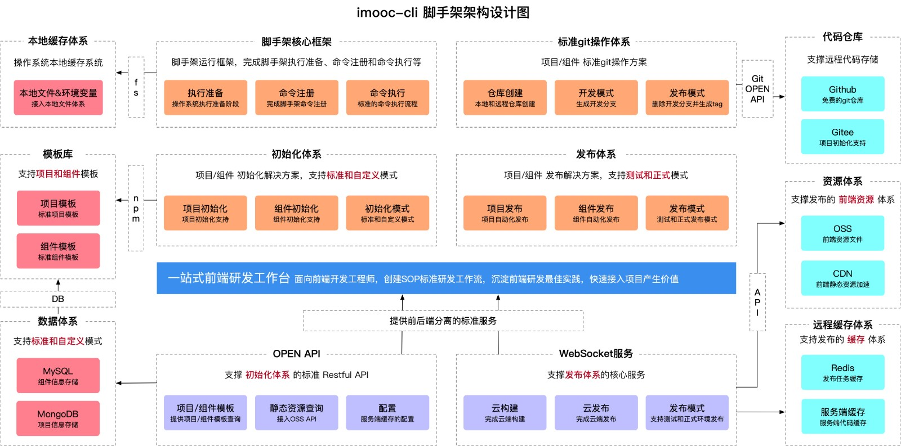
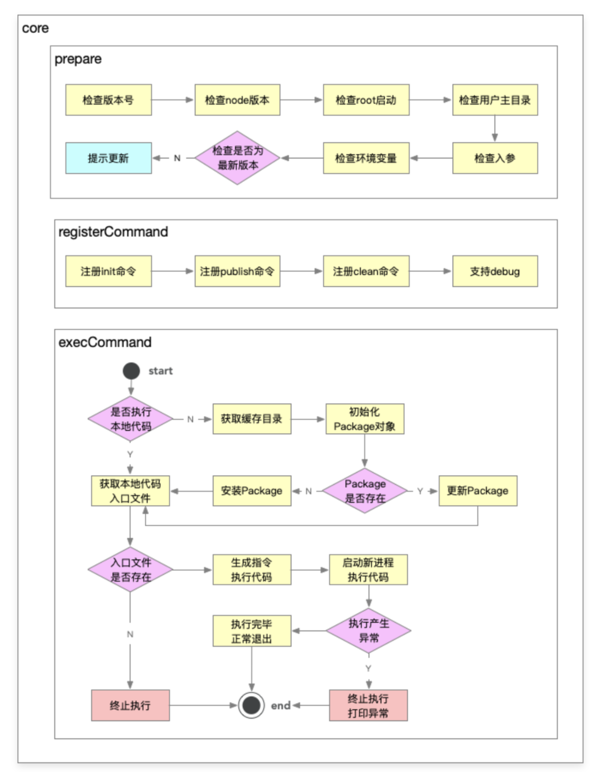

## 整体架构
## 从前端研发的视角看，脚手架是非常必要的
### 需要几个项目

2. 前端 - spa，比如编辑器，其他页面
3. 后端
4. 组件库

### 项目之之间的联系

## 存在的一些痛点问题

## 核心问题分析

### 海报

海报的组成

1. 背景 - 由图片和纯色组成
2. 元素
   a.由各种不同的元素、组件组成
   b.一部分属性界定位置 - position
   b.一部分属性界定他的展示 - looks

```json
// 可能的数据结构
{
  "page": {
    "title": "作品1",
    "props": {
      "backgroundImage": "",
      "backgroundPosition": "",
      "backgroundMusic": "aaa.mp3",
      "backgroundMusicAutoPlay": "true"
    }
  },
  // 考虑到图层的顺序问题，页面组成的呈现方式选用数组
  "components": [
    {
      // 指代对应的组件类型 - 可以和公共组件库的组件命名对应
      "name": "text", // 文本组件
      "id": 1, // 要由特殊的id，因为每个组件都是独特的，可能需要使用id筛选属性
      "props": {
        // 位置属性
        "left": "10px",
        "top": "20px",
        // 展示属性
        "text": "hello world",
        "fontSize": "16px"
      }
    },
    {
      "name": "image",
      "id": 2,
      "props": {
        // 位置属性
        "left": "10px",
        "top": "20px",
        // 展示属性
        "src": "https://xxx",
        "width": "100px",
        "height": "100px"
      }
    },
    {
      "name": "date", // 日期组件
      "id": 3,
      "props": {
        // 位置属性
        "left": "10px",
        "top": "20px",
        // 展示属
        "date": "now", // 不同类型的time
        "width": "100px",
        "height": "100px",
        "style": 1 // 日期展示的格式
      }
    }
  ]
}
```

### 数据流转

### 拓展设计

比如，场景设计。给海报添加对应的背景音乐。新的组件类型，比如说当前日期
技术方案设计，不要过多关注细节。为的就是寻找一个方向，论证，可行性，拓展性，复杂度高低

1. 创建项目或组件时，存在大量重复代码拷贝：快速复用已有沉淀
2. 协同开发，git 操作不规范，导致分支混乱，操作耗时：指定标准的 git 操作规范并集成到脚手架中
3. 发布上线耗时，而且容易出各种错误: 指定标准的上线流程和规范并集成到脚手架

## 需求分析

1. 通用的研发脚手架
2. 通用的项目、组件创建的能力

- 模版支持定制，定制后能够发布生效
- 模版支持快速接入，极低的接入成本

3. 通用的项目组件发布能力

- 发布过程自动完成标准的 git 操作
- 发布成功后，自动删除开发分支并创建 tag
- 发布后自动完成云构建、oss 上传、cdn 上传、域名绑定
- 发布过程支持测试、正式两种模式

## git 标准流

[fork 仓库之后的同步更新](https://cloud.tencent.com/developer/article/1398502)

```js
fork的意义？在多人项目开发中直接clone项目开发，每个人都可以提交代码到项目中难以保证本地代码和仓库代码的一致性，一个人代码出错，代码回溯困难，查找具体的修改记录也比较困难，设置分支的权限是可以避免随便提交的风险的。??
```

## 架构图操作

[架构图软件](https://app.diagrams.net/)
[破解地址](https://www.macwk.com/soft/omnigraffle/)

## lerna 核心操作

[lerna 官网简介](https://lerna.js.org/)

## 脚手架拆包策略 - 拆包结果



- 核心流程：index
- 命令： commands
  1. 初始化
  2. 发布
  3. 清除缓存
- 模型层： models
  1. Command 命令
  2. Project 项目
  3. Component 组件
  4. Npm 模块
  5. Git 仓库
- 支撑模块： utils
  1. git 操作
  2. 云构建
  3. 工具方法
  4. Api 请求
  5. Git Api

## 拆分原则

根据模块的功能拆分：

1. 核心模块：index
2. 命令模块：commands
3. 模型模块：models
4. 工具模块：utils

## index 模块技术方案



### 命令执行流程

- 准备阶段
  1. 检查版本号 - 后续版本升级需要，补充额外逻辑
  2. 检查 node 版本 - 版本不合适，后续不能执行
  3. 检查 root 启动 - 观察用户是否通过 sudo 这种方式启动,如果通过 root 这种方式启动，后续创建的这些文件可能很难维护，比如删除，可能删不了，因为通过 root 创建的文件，其他用户是不能进行访问的，如果是 root 用户，需要降级到普通用户。可以避免一系列的权限问题
  4. 检查用户主目录 - 确保能够拿到用户主目录，因为我们需要向主目录写入缓存，拿不到，执行停止。
  5. 检查入参
  6. 环境变量检测 - 也是为了缓存
  7. 检查是否为最新版本 - 提示更新
- 命令注册
- 命令执行

### 涉及技术点

1. 核心库

- import-local - 用于优先执行本地的命令
- commander - 通过 commander 做命令注册

2. 工具

- npmlog - 打印日志
- fs-extra - 基于 fs 封装的很多有价值的文件操作
- path-exists - 判断路径是否存在
- minimist - 检查入参
- semver - 版本比对，比如是否是最新版本
- colors - 在终端中打印不同颜色的文本
- user-home - 帮我们快速拿到用户的主目录
- dotenv - 获取环境变量
- root-check - root 账户的一个检查，自动降级
- url-join - url 的拼接，不需要考虑中间是否需要添加/,会自己拼接
- glob - 主要是用来匹配文件路径的，比如 lib/\*_/_.js 匹配 lib 目录下所有的 js 文件夹

## 命令的注册

## 高性能脚手架的设计

这样的架构设计已经可以满足一般脚手架需求，但是有以下两个问题：

- cli 安装速度慢：所有 index 都集成在 cli 里，因此当命令较多时，会减慢 cli 的安装速度
- 灵活性差：init 命令只能使用 @zhangli-cli-dev/init 包，对于集团公司而言，每个 bu 的 init 命令可能都各不相同，可能需要实现 init 命令动态化，如：

1. 团队 A 使用 @zhangli-cli-dev/init 作为初始化模块
2. 团队 B 使用自己开发的 @zhangli-cli-dev/my-init 作为初始化模块
3. 团队 C 使用自己开发的 @zhangli-cli-dev/your-init 作为初始化模块


### 是否执行本地代码

1.  在本地开发的时候，我们希望能指向本地的 init 代码文件，而不是缓存文件，需要标识当前 init 入口文件的绝对路径，给到绝对路径后，通过 require 来加载 require('xxxx/aaa/index.js')
2.  如果本地没有，需要通过 动态的 去下载代码，且加载进去，拿到缓存目录，初始化 package 对象(对应一个 npm module 比如我们执行的是 zhangli-cli-dev init 这个 package 就对应 init 的包名 有了 package 对象我们就可以进行判断，比如 package 就可以提供一个是否存在模块的功能，如果缓存目录里面已经存在了 index 模块 ，有尝试更新，没有，下载安装最新版本)
3.  安装完成之后，require 加载，获取本地代码入口文件 找到本地代码模块对应的一个地址，寻找 有没有入口文件，没有 直接 报错。如果有 动态生成执行代码的命令

比如 普通执行 node core/cli/bin/index.js 还有一种方式,通过字符串的方式进行执行 <code>node -e require('core/cli/bin/index.js')</code>

我们动态下载的模块其实只有一个路径，如果把这个路径中的代码执行起来 就是依靠 node -e 就可以动态生成执行代码的字符串或者一条命令，接着启动一个新的进程去执行这条命令，提升性能 - 依靠 node 多进程

优点：完全不依赖当前脚手架去执行命令，可以通过命令的一个地址把他执行起来

## 环境变量总结

- CLI_HOME_PATH - 缓存路径
- CLI_HOME
- LOG_LEVEL
- CLI_TARGET_PATH

## 进程相关概念学习
