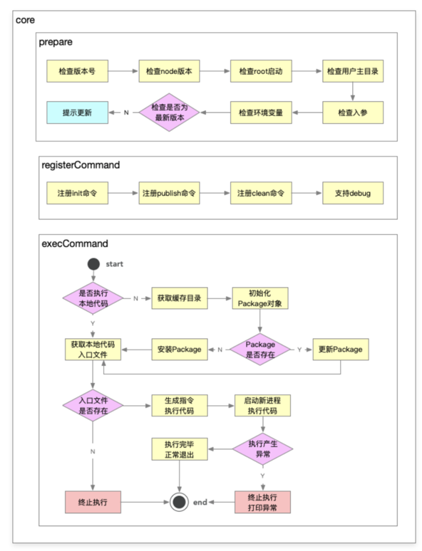

## 基础

- \_\_filename 代表当前执行文件 - 绝对路径
- \_\_dirname 代表当前文件运行的文件夹 - 绝对路径
- process.cwd() 当前工作目录下,是可以改变的

```js
npm link 链接过程
/Users/zhangli/.nvm/versions/node/v16.15.1/bin/zl-cli-test ->
/Users/zhangli/.nvm/versions/node/v16.15.1/lib/node_modules/zl-cli-test->
/Users/zhangli/learning_code/zhangli-cli-dev/cli-test/zl-cli-test
```

## lerna 基础

为什么需要？原生脚手架开发会有很多痛点

- 重复操作

  1. 多 package 本地 link
  2. 多 package 依赖安装
  3. 多 package 单元测试
  4. 多 package 代码提交
  5. 多 package 代码发布

- 版本一致性

  1. 发布时版本一致性
  2. 发布后相互依赖版本升级。（package 越多，管理复杂度就越高）

- 优势
  - 大幅减少重复操作
  - 提升操作的标准化

## 项目初始化

```js
npm i lerna -g
lerna init

// npm注册 组织 @zhangli-cli-dev
```

## lerna 核心操作

[lerna 官网简介](https://lerna.js.org/)
[lerna add ](https://github.com/lerna/lerna/tree/main/commands/add)

```js
// 指定安装到某一个package下
lerna -h
lerna add lodash-es utils/log
// 安装依赖并且完成软连接
lerna bootstrap
lerna create @zhangli-cli-dev/get-npm-infos utils

lerna updated // 查看更新包
```

##

## 架构设计

1. 脚手架

- 脚手架核心框架
  - lerna 是对整个脚手架做了框架的设计，通过 yargs 注册了所有脚手架的命令，同时生成脚手架的执行流程。
  - zhangli-cli-dev 也需要脚手架核心框架的设计，完成脚手架的执行流程，包括命令的执行，异常的监听等一系列操作
- 初始化体系
- 标准 git 操作体系
  - 仓库创建能力(git 初始化的过程) - 当 git 仓库没有创建，自动创建，包括本地和远程
  - 开发模式 - 创建 dev 分之分支，将代码同步到远程仓库当中
  - 发布模式 - 删除 dev 分之，创建 tag，完成代码同步
  1. 外部依赖 - 代码仓库，因为要初始化
- 发布体系
  主要包括：也需要相应的服务，使用 api，后台执行任务，但是前台不好收到反馈。体验差，如果通过心跳的方式实现，也行。最好是 websocket 服务，发布体系调用 webSocket 服务，体验更好一点
  - 云发布
  - 云构建
  1. 外部依赖 - 依赖资源体系，比如所有的发布都可以发布到资源体系。
  构建的产物要上传到oss，同事oss要同步到cdn（oss不能直接加速），保证访问速度

2. 服务

- OPEN API - 通用能力的提供，外部项目的接入，需要调用 Api
  - 项目、组件 基础模版的提供
  - 静态资源的查询能力  
    组件当中可能会做一些查询，可能会直接查询到组件的构建结果当中，构建结果一般都放在静态资源库当中
  - 配置信息
    比如，在某一个点上，我们可能需要一个动态的信息，一般存储在配置文件中，通过 api 的方式调取，不管是存储在文件还是数据库中
- Websocket
  - 云构建
  - 云发布
  - 发布模式

3. 支撑体系

- 本地缓存
- 模板库
- 数据体系
- 代码仓库
- 资源体系
- 远程缓存

## 脚手架拆包策略 - 拆包结果


- 核心流程：index
- 命令： commands
  1. 初始化
  2. 发布
  3. 清除缓存
- 模型层： models
  1. Command 命令
  2. Project 项目
  3. Component 组件
  4. Npm 模块
  5. Git 仓库
- 支撑模块： utils
  1. git 操作
  2. 云构建
  3. 工具方法
  4. Api 请求
  5. Git Api

## 拆分原则

根据模块的功能拆分：

1. 核心模块：index
2. 命令模块：commands
3. 模型模块：models
4. 工具模块：utils

## index 模块技术方案



### 命令执行流程

- 准备阶段
  1. 检查版本号 - 后续版本升级需要，补充额外逻辑
  2. 检查 node 版本 - 版本不合适，后续不能执行
  3. 检查 root 启动 - 观察用户是否通过 sudo 这种方式启动,如果通过 root 这种方式启动，后续创建的这些文件可能很难维护，比如删除，可能删不了，因为通过 root 创建的文件，其他用户是不能进行访问的，如果是 root 用户，需要降级到普通用户。可以避免一系列的权限问题
  4. 检查用户主目录 - 确保能够拿到用户主目录，因为我们需要向主目录写入缓存，拿不到，执行停止。
  5. 检查入参
  6. 环境变量检测 - 也是为了缓存
  7. 检查是否为最新版本 - 提示更新
- 命令注册
- 命令执行
  - 是否加载本地文件 - 是说 init 能够指向本地的代码文件，而不是缓存文件，需要参数去标识当前 init 文件的绝对路径
    如果本地代码没有，动态的去下载，并且加载进去，拿到缓存目录这条路径。如果缓存目录有这个模块，尝试做一次更新，没有直接安装，通过 require 方式进行加载，再去看有没有入口文件，动态生成执行代码的命令 node -e '',启动新进程去执行
  - 判断 targetPath 是否存在，如果存在，直接获取本地代码进行开发，不存在，创建缓存目录，拿到 package，缓存到本地
  - 实现 Package 类

### 涉及技术点

1. 核心库

- import-local - 用于优先执行本地的命令
- commander - 通过 commander 做命令注册

2. 工具

- npmlog - 打印日志
- fs-extra - 基于 fs 封装的很多有价值的文件操作
- path-exists
- minimist 检查入参
- semver - 版本比对，比如是否是最新版本
- colors - 在终端中打印不同颜色的文本
- user-home - 帮我们快速拿到用户的主目录
- dotenv - 获取环境变量
- root-check - root 账户的一个检查，自动降级
- url-join

## 命令的注册

## 高性能脚手架的设计

这样的架构设计已经可以满足一般脚手架需求，但是有以下两个问题：

- cli 安装速度慢：所有 index 都集成在 cli 里，因此当命令较多时，会减慢 cli 的安装速度
- 灵活性差：init 命令只能使用 @zhangli-cli-dev/init 包，对于集团公司而言，每个 bu 的 init 命令可能都各不相同，可能需要实现 init 命令动态化，如：

1. 团队 A 使用 @zhangli-cli-dev/init 作为初始化模块
2. 团队 B 使用自己开发的 @zhangli-cli-dev/my-init 作为初始化模块
3. 团队 C 使用自己开发的 @zhangli-cli-dev/your-init 作为初始化模块


### 是否执行本地代码

1.  在本地开发的时候，我们希望能指向本地的 init 代码文件，而不是缓存文件，需要标识当前 init 入口文件的绝对路径，给到绝对路径后，通过 require 来加载 require('xxxx/aaa/index.js')
2.  如果本地没有，需要通过 动态的 去下载代码，且加载进去，拿到缓存目录，初始化 package 对象(对应一个 npm module 比如我们执行的是 zhangli-cli-dev init 这个 package 就对应 init 的包名 有了 package 对象我们就可以进行判断，比如 package 就可以提供一个是否存在模块的功能，如果缓存目录里面已经存在了 index 模块 ，有尝试更新，没有，下载安装最新版本)
3.  安装完成之后，require 加载，获取本地代码入口文件 找到本地代码模块对应的一个地址，寻找 有没有入口文件，没有 直接 报错。如果有 动态生成执行代码的命令

比如 普通执行 node core/cli/bin/index.js 还有一种方式,通过字符串的方式进行执行 <code>node -e require('core/cli/bin/index.js')</code>

我们动态下载的模块其实只有一个路径，如果把这个路径中的代码执行起来 就是依靠 node -e 就可以动态生成执行代码的字符串或者一条命令，接着启动一个新的进程去执行这条命令，提升性能 - 依靠 node 多进程

优点：完全不依赖当前脚手架去执行命令，可以通过命令的一个地址把他执行起来

## 环境变量总结

- CLI_HOME_PATH - 缓存目录 /Users/zhangli/.zhangli-cli-dev
- CLI_HOME
- LOG_LEVEL
- CLI_TARGET_PATH - 调试目录

## 进程相关概念学习

## 通用脚手架命令 Command 类的封装

- 检查 node 版本调整
- 参数初始化
- 利用 node 多进程执行动态命令

## 获取项目基本信息

## 模板相关

```js
mongod --dbpath=/Users/zhangli/data/db
```

## 创建功能架构设计

### 架构背后的思考

1. 可扩展：能够快速复用到不同团队，适应不同团队之间的差异
2. 低成本：在不改动脚手架源码的情况下，能够新增模板，且新增模板的成本很低
3. 高性能：控制存储空间，安装时充分利用 Node 多进程提升安装性能

### 架构设计图


1. 准备阶段 - 项目的基本信息应该预先确认，否则安装过程中中断会非常影响用户体验,此阶段需要借助命令行交互库 inquirer 来完成项目信息的收集

- 确保项目的安装环境
- 确认项目的基本信息

2. 下载模板

   - 下载模板是利用已经封装 Package 类快速实现相关功能
   - npm init egg -> npm init egg 相当于执行 npx create-egg，npx create-egg 命令会下载 create-egg 库，再执行里面的 bin(package.json 里的 bin 字段)。npx create-egg 会在当前目录/node_modules 目录下查找有没有 create-egg，没有就会下载到临时目录，最后删除
   - https://www.cnblogs.com/cool-fire/p/11007329.html

3. 安装模板

- 标准模式下，将通过 ejs 实现模板渲染，并自动安装依赖并启动项目
- 自定义模式下，将允许用户主动去实现模板的安装过程和后续启动流程
